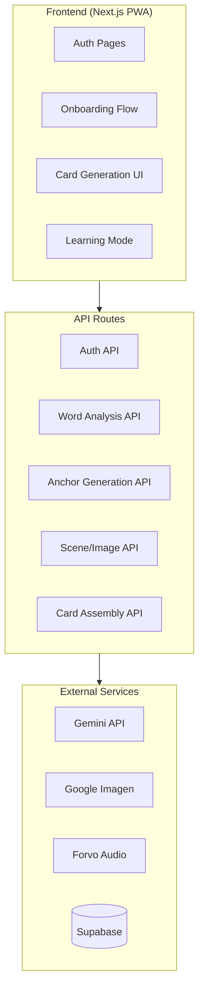
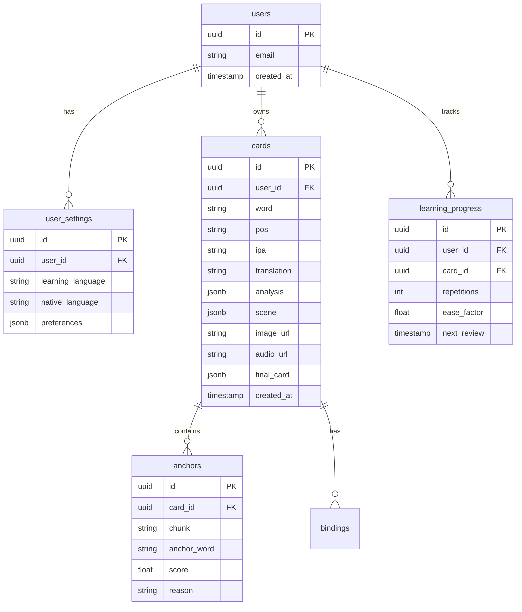

# WordFactory MVP Development Plan

## Architecture Overview



## Tech Stack

- **Package Manager**: bun
- **Framework**: Next.js 14 (App Router)
- **UI**: React + Tailwind CSS (mobile-first)
- **Database**: Supabase PostgreSQL
- **Auth**: Supabase Auth
- **AI**: Google Gemini API (text/analysis), Google Imagen (images)
- **Audio**: Forvo API
- **Hosting**: Vercel
- **PWA**: next-pwa

## Database Schema



## Project Structure

```
WordFactory/
├── src/
│   ├── app/
│   │   ├── (auth)/
│   │   │   ├── login/page.tsx
│   │   │   └── register/page.tsx
│   │   ├── (main)/
│   │   │   ├── onboarding/page.tsx
│   │   │   ├── create/page.tsx
│   │   │   ├── learn/page.tsx
│   │   │   └── cards/page.tsx
│   │   ├── api/
│   │   │   ├── analyze/route.ts
│   │   │   ├── anchors/route.ts
│   │   │   ├── scene/route.ts
│   │   │   ├── image/route.ts
│   │   │   └── audio/route.ts
│   │   ├── layout.tsx
│   │   └── page.tsx
│   ├── components/
│   │   ├── ui/
│   │   └── card-creation/
│   ├── lib/
│   │   ├── supabase/
│   │   ├── gemini/
│   │   └── utils/
│   └── types/
├── public/
├── .env.local
├── package.json
└── next.config.js
```

## Implementation Phases

### Phase 1: Project Setup and Auth

- Initialize Next.js with bun, Tailwind, PWA config
- Setup Supabase client and database schema
- Implement auth pages (login/register)
- Create base layout with mobile-first navigation

### Phase 2: Onboarding Flow

- Language selection (learning + native)
- User preferences storage
- Welcome tutorial screens

### Phase 3: Card Creation Pipeline (Core Feature)

Step-by-step UI with confirmation at each stage:

1. **Word Input** - User enters word to learn
2. **Analysis Display** - Show word analysis, POS, translation (Gemini)
3. **Phonetic Chunking** - Display chunks, allow user confirmation
4. **Anchor Selection** - Show anchor candidates with scores, user picks
5. **Binding Preview** - Show proposed scene structure
6. **Image Generation** - Generate and display image (Imagen)
7. **Audio Fetch** - Get pronunciation (Forvo)
8. **Final Card** - Assemble and save

### Phase 4: Learning Mode

- Card review with spaced repetition
- Show image, reveal word/translation
- Track progress

### Phase 5: Polish and Deploy

- PWA manifest and service worker
- Performance optimization
- Vercel deployment

## Key API Endpoints

- `POST /api/analyze` - Word analysis (Gemini)
- `POST /api/anchors` - Generate phonetic anchors (Gemini)
- `POST /api/scene` - Build scene structure (Gemini)
- `POST /api/image` - Generate image (Imagen)
- `GET /api/audio` - Fetch pronunciation (Forvo)
- `POST /api/cards` - Save final card (Supabase)

## Environment Variables

```env
GOOGLE_CLOUD_API_KEY=<from .env>
NEXT_PUBLIC_SUPABASE_URL=https://rfhlkeqbrumryvlnfmbl.supabase.co
NEXT_PUBLIC_SUPABASE_ANON_KEY=<retrieved from MCP>
FORVO_API_KEY=<if needed>
```

## Git Workflow

After each feature completion:

1. Stage changes
2. Commit with descriptive message
3. Push to https://github.com/tairqaldy/WordFactory